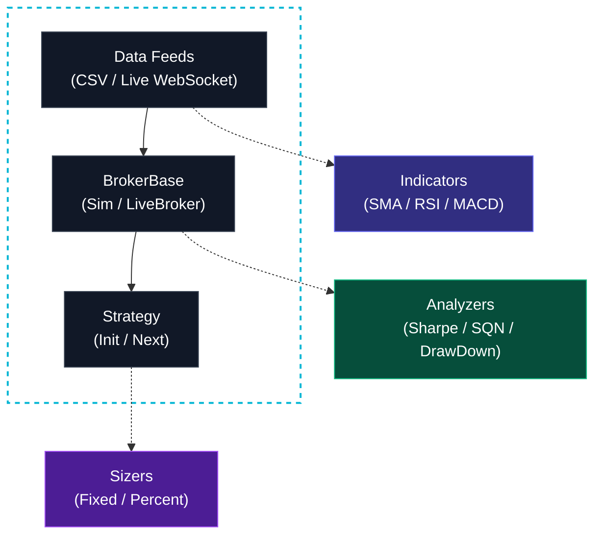

<p align="center">
  <h1 align="center">🚀 gobacktrader</h1>
  <p align="center">
    <strong>A powerful algorithmic trading backtesting framework for Go</strong><br>
    Inspired by <a href="https://www.backtrader.com">Backtrader</a> (Python) · Built for performance · Go-native idioms
  </p>
  <p align="center">
    <a href="#features">Features</a> ·
    <a href="#quick-start">Quick Start</a> ·
    <a href="#indicators">Indicators</a> ·
    <a href="#analyzers">Analyzers</a> ·
    <a href="#live-feeds">Live Feeds</a> ·
    <a href="#examples">Examples</a>
  </p>
</p>

---

**gobacktrader** is a Go port of the popular [Backtrader](https://www.backtrader.com) Python framework. It provides a complete ecosystem for developing, backtesting, and paper-trading algorithmic trading strategies — all in pure Go with zero CGo dependencies.

### The Platform Objectives
1. **Ease of use**
2. **Go back to 1**

*(Loosely based on the Karate Kid rules by Mr. Miyagi)*

```go
c := engine.NewCerebro()
c.SetCash(10_000)
c.AddCSV(feeds.DefaultYahooConfig("data.csv"))
c.AddStrategy(func() engine.Strategy { return &MyStrategy{} })
results, _ := c.Run()
```

## Features

| Category | What you get |
|----------|-------------|
| **Core Engine** | Cerebro orchestrator, simulated Broker, Orders (Market/Limit/Stop/StopLimit/StopTrail/Bracket/OCO), Slippage, Position tracking, Trade PnL |
| **Data Feeds** | CSV (Yahoo Finance format), WebSocket, REST API, NATS, Redis Streams, Kafka |
| **10 Indicators** | SMA, EMA, WMA, DEMA, TEMA, RSI, MACD, Stochastic, ATR, Bollinger Bands |
| **5 Analyzers** | Returns, Sharpe Ratio, Max Drawdown, Trade Analyzer, SQN (Van Tharp) |
| **Position Sizing** | Fixed, Percent-of-portfolio, All-in sizers |
| **Live Trading** | `RunLive(ctx)` plus pluggable `LiveBroker` and `OrderRouter` for true paper/live trading |
| **Testing** | 41 tests across 8 packages — all passing |

## Installation

```bash
go get github.com/thangtmkafi/gobacktrader
```

Requires **Go 1.21+**.

## Quick Start: The Basics

Running the platform fundamentally boils down to two distinct phases:

### 1. Create a Strategy
*   Decide on potential adjustable parameters
*   Instantiate the **Indicators** you need in the Strategy
*   Write down the logic for entering/exiting the market

```go
package main

import (
    "math"
    "github.com/thangtmkafi/gobacktrader/engine"
    "github.com/thangtmkafi/gobacktrader/indicators"
)

type SMACross struct {
    ctx  *engine.StrategyContext
    fast *indicators.SMA
    slow *indicators.SMA
}

func (s *SMACross) Init(ctx *engine.StrategyContext) {
    s.ctx = ctx
    s.fast = indicators.NewSMA(ctx.PreloadedData(), 10)
    s.slow = indicators.NewSMA(ctx.PreloadedData(), 30)
}

func (s *SMACross) Next() {
    fast := s.fast.Line().Get(0)
    slow := s.slow.Line().Get(0)
    fastPrev := s.fast.Line().Get(-1)
    slowPrev := s.slow.Line().Get(-1)

    if math.IsNaN(fast) || math.IsNaN(slow) || math.IsNaN(fastPrev) || math.IsNaN(slowPrev) {
        return
    }

    pos := s.ctx.GetPosition(s.ctx.Data())
    
    // Cross over: Buy
    if !pos.IsOpen() && fastPrev <= slowPrev && fast > slow {
        // Position Sizing: Risk 10% of our portfolio
        size := engine.PercentSizer{Percent: 0.10}.Size(s.ctx, s.ctx.Data())
        
        // Enter via Bracket Order: Take Profit at +5%, Stop Loss at -2%
        price := s.ctx.Data().Close.Get(0)
        s.ctx.BuyBracket(size, price*1.05, price*0.98)
    } 
    
    // Cross under: Liquidate
    if pos.IsOpen() && fastPrev >= slowPrev && fast < slow {
        s.ctx.Close()
    }
}
```

### 2. Create a Cerebro Engine
*   Inject the Strategy
*   Load and Inject a Data Feed
*   Execute `cerebro.Run()`

```go
package main

import (
    "fmt"
    "github.com/thangtmkafi/gobacktrader/analyzers"
    "github.com/thangtmkafi/gobacktrader/engine"
    "github.com/thangtmkafi/gobacktrader/feeds"
)

func main() {
    c := engine.NewCerebro()
    
    // Portfolio & Realism Setup
    c.SetCash(100_000)
    c.SetSlippagePercent(0.001) // 0.1% slippage on all orders
    c.SetCommission(engine.FuturesCommission{Margin: 2000, Multiplier: 50}) // Futures margin
    
    c.AddCSV(feeds.DefaultYahooConfig("AAPL.csv"))
    c.AddStrategy(func() engine.Strategy { return &SMACross{} })

    // Attach analyzers
    c.AddAnalyzer(&analyzers.Returns{})
    c.AddAnalyzer(&analyzers.SharpeRatio{AnnualisationFactor: 252})
    c.AddAnalyzer(&analyzers.DrawDown{})
    c.AddAnalyzer(&analyzers.TradeAnalyzer{})
    c.AddAnalyzer(&analyzers.SQN{})

    results, err := c.Run()
    if err != nil {
        panic(err)
    }

    r := results[0]
    fmt.Printf("Final Value: $%.2f\n", r.FinalValue)
    fmt.Printf("Trades: %d\n", len(r.Trades))
}
```

## Data Feeds

Data feeds (like <code>feeds.GenericCSVData</code>) supply the `core.DataSeries` timeline. Multiple feeds can be injected into Cerebro (`Data0`, `Data1`, etc.) for multi-timeframe backtesting.

## Strategies

Everything you write lives in a Strategy. The `Init(ctx)` method is strictly for declaring parameters and instantiating **Indicators**. The `Next()` method processes the logic bar-by-bar.

## Indicators

Build indicators in `Init()` using `ctx.PreloadedData()`, then read values in `Next()`:

```go
func (s *MyStrategy) Init(ctx *engine.StrategyContext) {
    data := ctx.PreloadedData()
    s.rsi  = indicators.NewRSI(data, 14)
    s.macd = indicators.NewMACD(data, 12, 26, 9)
    s.bb   = indicators.NewBollingerBands(data, 20, 2.0)
    s.atr  = indicators.NewATR(data, 14)
}

func (s *MyStrategy) Next() {
    rsi   := s.rsi.Line().Get(0)       // current RSI
    macd  := s.macd.Line().Get(0)      // MACD line
    signal := s.macd.Signal().Get(0)   // signal line
    upper := s.bb.Upper().Get(0)       // upper Bollinger band
    atr   := s.atr.Line().Get(0)       // current ATR
}
```

| Indicator | Constructor | Lines |
|-----------|-----------|-------|
| **SMA** | `NewSMA(data, period)` | `.Line()` |
| **EMA** | `NewEMA(data, period)` | `.Line()` |
| **WMA** | `NewWMA(data, period)` | `.Line()` |
| **DEMA** | `NewDEMA(data, period)` | `.Line()` |
| **TEMA** | `NewTEMA(data, period)` | `.Line()` |
| **RSI** | `NewRSI(data, period)` | `.Line()` (0–100) |
| **MACD** | `NewMACD(data, fast, slow, signal)` | `.Line()` `.Signal()` `.Histogram()` |
| **Stochastic** | `NewStochastic(data, k, d)` | `.K()` `.D()` |
| **ATR** | `NewATR(data, period)` | `.Line()` |
| **Bollinger** | `NewBollingerBands(data, period, devs)` | `.Mid()` `.Upper()` `.Lower()` |

## Sizers

By default, orders take raw floating-point sizes, but gobacktrader provides utility modules to compute sizes dynamically against portfolio equity (`FixedSizer`, `PercentSizer`, `AllInSizer`).

```go
sizer := engine.PercentSizer{Percent: 0.10}
size := sizer.Size(ctx, ctx.Data())
ctx.Buy(size)
```

## Orders & Execution

gobacktrader natively routes advanced OCO (One-Cancels-Other) groups to protect positions automatically.

```go
// Buy at market, place a limit take profit at +5%, and stop loss at -2%
price := ctx.Data().Close.Get(0)
ctx.BuyBracket(size, price*1.05, price*0.98)

// Add trailing stops to lock in profits dynamically
ctx.Buy(size, engine.WithStopTrailPercent(0.05))
```

## Analyzers

Attach to Cerebro before `Run()` — they compute automatically:

```go
ret    := &analyzers.Returns{}
sharpe := &analyzers.SharpeRatio{AnnualisationFactor: 252}
dd     := &analyzers.DrawDown{}
ta     := &analyzers.TradeAnalyzer{}
sqn    := &analyzers.SQN{}

c.AddAnalyzer(ret)
c.AddAnalyzer(sharpe)
c.AddAnalyzer(dd)
c.AddAnalyzer(ta)
c.AddAnalyzer(sqn)

c.Run()

ret.Print()    // Total return %, PnL, best/worst trade
sharpe.Print() // Annualised Sharpe Ratio
dd.Print()     // Max drawdown %, duration
ta.Print()     // Win rate, profit factor, consec wins/losses
sqn.Print()    // System Quality Number + grade
```

## From Backtest to Live Trade

Transitioning a proven strategy from historical backtesting to real-time live trading is a seamless 3-step process in `gobacktrader`. **You do not need to change your strategy code.**

### Step 1: Swap Data Feeds
Replace your `feeds.GenericCSVData` with a live streaming source from the `livefeeds` package.

```go
// WebSocket
feed := livefeeds.NewWebSocketFeed(livefeeds.WebSocketConfig{
    URL:    "wss://stream.example.com/bars",
    Symbol: "BTCUSDT",
})

// REST API polling
feed := livefeeds.NewRESTFeed(livefeeds.RESTConfig{
    URL:          "https://api.example.com/bars/AAPL",
    PollInterval: 1 * time.Minute,
    ParseFunc:    myParser,
})

// NATS
feed := livefeeds.NewNATSFeed(livefeeds.NATSConfig{
    URL:     "nats://localhost:4222",
    Subject: "market.bars.AAPL",
})

// Redis Streams
feed := livefeeds.NewRedisFeed(livefeeds.RedisConfig{
    Addr:   "localhost:6379",
    Stream: "bars:AAPL",
})

// Kafka
feed := livefeeds.NewKafkaFeed(livefeeds.KafkaConfig{
    Brokers: []string{"localhost:9092"},
    Topic:   "market-bars",
})

c.AddData(feed)
```

### Step 2: Swap the Broker
By default, `Cerebro` runs a simulated backtesting broker. To route your orders to the real world (or a paper trading API), inject a `LiveBroker` hooked up to your exchange's `OrderRouter`.

```go
// Initialize your custom exchange API router
router := myexchange.NewRouter("API_KEY", "API_SECRET")

// Wrap it in a LiveBroker (maintaining local state syncing)
lb := livebrokers.NewLiveBroker(router, 100_000)

// tell Cerebro to use it
c.SetBroker(lb)
```

### Step 3: Execute `RunLive`
Finally, instead of evaluating a fixed dataset via `c.Run()`, use `c.RunLive(ctx)`. It blocks indefinitely until the context is cancelled or the data stream closes.

```go
ctx, cancel := context.WithCancel(context.Background())
defer cancel()

// Begins the live trading event loop
results, err := c.RunLive(ctx)
```

## Brokers & Live Routing

The engine operates on the `BrokerBase` interface. By default, it uses a simulated broker for backtesting. 

### Simulator Mechanics
The default backtesting broker is a deterministic simulator closely mapping the Python Backtrader engine:
- **Cash vs Value**: Tracks `Cash` (liquid capital for margins/fees) independently from `Value` (total portfolio equity including unrealized PnL).
- **Execution Evaluation**: Orders placed during Bar *N* are strictly evaluated for execution against the price markers (Open, High, Low, Close) of Bar *N+1* to negate look-ahead bias. 
- **Volume Fills**: Orders default to 100% fulfillments upon trigger but can be constrained to partial fills if a volume proportion (e.g., 10% of bar volume) is specified.

### Live & Paper Trading
For live or paper trading, you can swap the simulator with a `LiveBroker` that maintains simulated constraints locally while concurrently routing real orders to an external exchange via the `OrderRouter` interface.

Developing a custom broker integration involves simply implementing the 4-method `OrderRouter` interface:

```go
type OrderRouter interface {
    PlaceOrder(ctx context.Context, order *engine.Order) (string, error)
    CancelOrder(ctx context.Context, exchangeRef string) error
    GetPositions(ctx context.Context) ([]livebrokers.LivePosition, error)
    GetCash(ctx context.Context) (float64, error)
}
```

Then plug your custom router into `Cerebro`:

```go
router := myexchange.NewRouter(apiKeys)
// Initialize LiveBroker with your router and starting cash
lb := livebrokers.NewLiveBroker(router, 100_000)

// Direct Cerebro to use the LiveBroker
c.SetBroker(lb)
```

## Examples

```bash
# Backtest SMA crossover
go run ./examples/sma_cross/

# Live demo (self-contained WebSocket replay)
go run ./examples/live_demo/
```

## Project Structure

```
gobacktrader/
├── core/           # Line, DataSeries — fundamental data structures
├── feeds/          # CSV data feed (Yahoo Finance format)
├── engine/         # Cerebro, Broker, Order, Position, Trade, Strategy, Sizer
├── indicators/     # 10 technical indicators
├── analyzers/      # 5 performance analyzers
├── livefeeds/      # WebSocket, REST, NATS, Redis, Kafka live feeds
├── livebrokers/    # Live and Paper trading broker plugins
├── examples/
│   ├── sma_cross/  # Backtest example
│   └── live_demo/  # Live trading demo
└── testdata/       # Sample CSV data
```

## Architecture



## Testing

```bash
go test ./...
# 41 tests across 8 packages
```

## Backtrader Comparison

| Feature | Backtrader (Python) | gobacktrader (Go) |
|---------|-------------------|-------------------|
| Language | Python 3 | Go 1.21+ |
| Indicators | 100+ | 10 (core set) |
| Data feeds | CSV, IB, Oanda | CSV, WS, REST, NATS, Redis, Kafka |
| Live trading | Yes (IB, Oanda) | Live & Paper trading (pluggable OrderRouter) |
| Performance | ~1x | ~10-50x faster |
| Concurrency | GIL-limited | Native goroutines |

## License

MIT

## Contributing

Contributions welcome! Please open an issue first to discuss what you'd like to change.

---

<p align="center">
  Built with ❤️ in Go · Inspired by <a href="https://www.backtrader.com">Backtrader</a>
</p>
